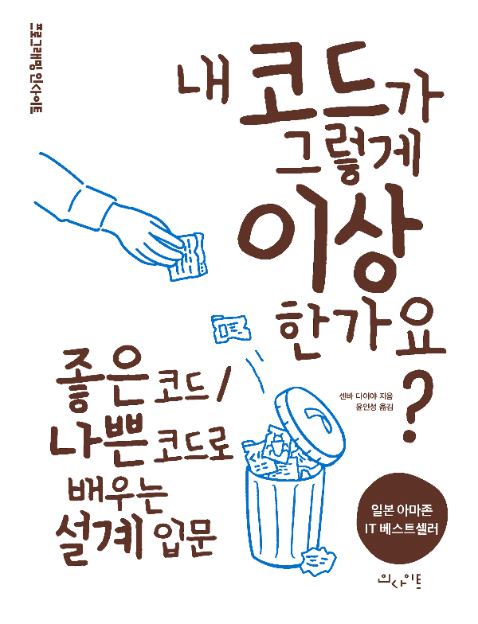

# 내 코드가 그렇게 이상한가요? - 좋은코드 나쁜코드로 배우는 설계 입문
이 저장소는 인사이트 출판사의 [내 코드가 그렇게 이상한가요?](https://insightbook.co.kr/book/150) 도서를 사내 스터디로 진행하며 정리 중인 문서입니다.

본 책은 객체 지향 설계를 통해 코드 품질을 높이는 방법을 설명하며, 자바로 된 책의 예제 코드를 파이썬으로 작성하여 실습을 진행하였습니다.

<figure></figure>
